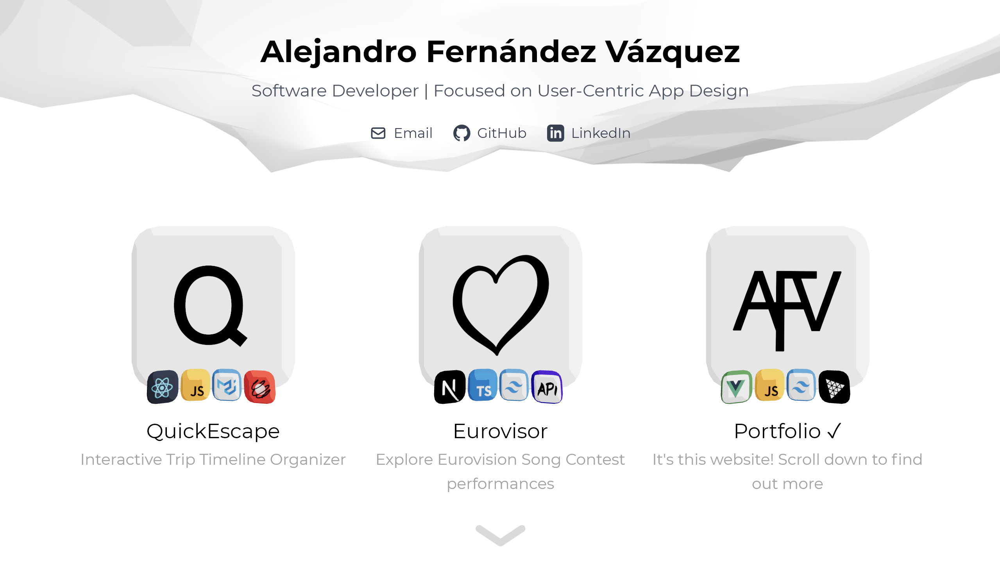
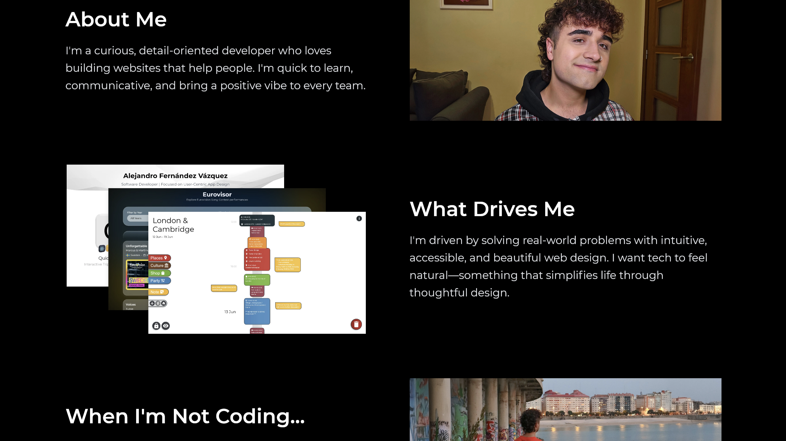

# 💼 My Portfolio
[Link to the Live Demo](https://afvportfolio.netlify.app/)

AFV portfolio is a sleek, Vue-based portfolio website showcasing my projects and facts about  be with immersive 3D interactions. Split into two main sections, Projects and About Me, it blends smooth parallax scrolling and fluid animations for a modern, minimalistic experience. 

---

### Table of Contents

- [Features](#features)
- [Screenshots](#screenshots)
- [Installation](#installation)
- [Usage](#usage)
- [Technologies](#technologies)
- [Project Structure](#project_structure)
- [Future Enhancements](#future_enhancements)
- [License](#license)

---
<a id="features"></a>

## ✨ Features

- **3D Elements**:
  - **Project Cards:** Interactive 3D cards with MeshToon shading, equiped with Mini-Cards to showcase technologies, that rotate following the cursor for dynamic engagement.
  - **Animated Wave Header:** A vibrant 3D wave background element that animates behind the header for visual impact.

- **Scroll Transitions:**
  - **Section Transitions:** Vertical black-strip wipe animation when transitioning between sections.
  - **Parallax Scrolling:** Smooth parallax effects throughout the page for immersive navigation.

- **Hover & Click Animations:** Subtle circular hover effects indicate clickable elements, with smooth transitions to different URLs.

- **Auto-Scroll Buttons:** Navigation buttons at the end of each section prompt users to scroll to the next section or return to the top.

---
<a id="screenshots"></a>

## 📷 Screenshots

**Projects Section** 


**About Me Section**  


---
<a id="installation"></a>

## Installation

1. **💾 Clone the repository:**

   ```sh
   git clone https://github.com/ferni2768/portfolio.git
   ```

2. **📂 Navigate to the project directory:**

   ```sh
   cd portfolio
   ```

3. **📦 Install dependencies:**

   ```sh
   npm install
   ```

4. **▶️ Start the development server:**

   ```sh
   npm start
   ```

---
<a id="usage"></a>

## Usage

### Explore Projects

- **Hover Effects:** Hover over a 3D project card or its tech mini-cards to trigger the circular hover animation.
- **Interactive Links:** Click on a card or icon to open a related link—such as email, GitHub, LinkedIn, or a live demo.

### Navigate Sections

- **Scrolling or Buttons:** Scroll manually or click the auto-scroll buttons to navigate between the Projects and About Me sections.
- **Quick Top Access:** In the About Me section, click the auto-scroll button to jump back to the header instantly.

### Learn About Me

- **Scroll Discovery:** Scroll through the About Me section to reveal some facts about me.
- **Contact Button:** Use the “Contact Me” button to quickly send me an email.

### Return to Top


---
<a id="technologies"></a>

## 🤖 Technologies

- **Vue.js:** Frontend library for building the UI.
- **JavaScript:** Core programming language.
- **TailwindCSS:** Utility-first CSS framework for fast, responsive styling.
- **Three.js:** Allows for the creation of 3D elements in the app.
- **Overlayscrollbars Vue:** Customize scrollbar component.
- **Simplex-Noise:** Generates smooth noise (used along Three.js for 3D Background Waves).

---
<a id="project_structure"></a>

## 🏗️ Project Structure

```
portfolio/
├── public/                             # Static assets
├── src/
│   ├── assets/                         # Project and README images
│   ├── components/
│   │   ├── AboutSection.vue            # Section with personal information
│   │   ├── MouseCircle.vue             # Hovering circle effect
│   │   ├── ProjectsSection.vue         # Section with project 3D cards
│   │   ├── ThreeDBackgroundWaves.vue   # Animated 3D background element
│   │   └── ThreeDCard.vue              # 3D card representing a project
│   ├── App.vue                         # Main app component
│   └── main.js                         # Registers plugins and mounts the app
├── package.json                        # Dependencies & scripts
├── LICENSE                             # License info
└── README.md                           # Project docs
```

---
<a id="future_enhancements"></a>

## 🔮 Future Enhancements

- **More Projects:** New projects will be added to this page.
- **UI enhancements:** Add more animations and quality of life improvements.
- **Translations:** Support for Swedish and Spanish language.
- **Dark mode**

---
<a id="license"></a>

## 🔑 License

This project is licensed under the [MIT License](LICENSE).